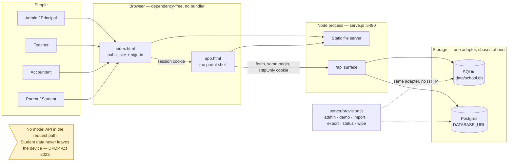
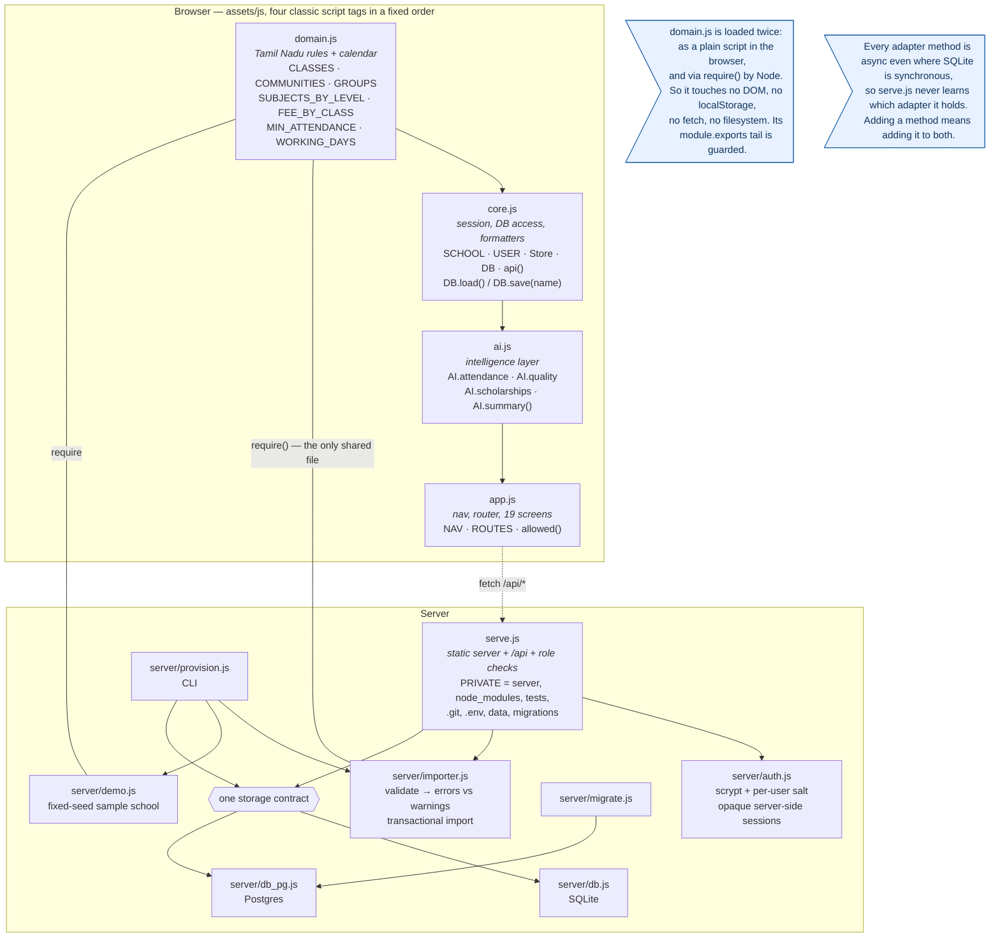
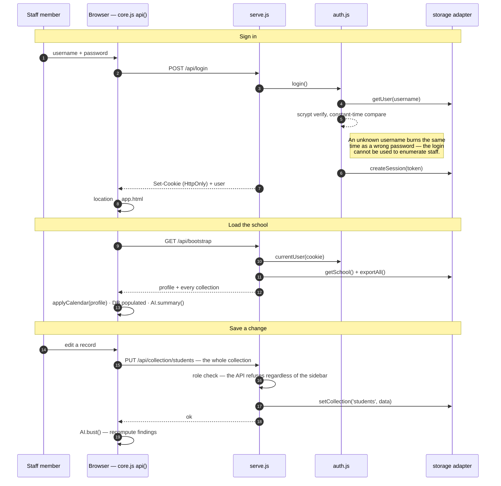
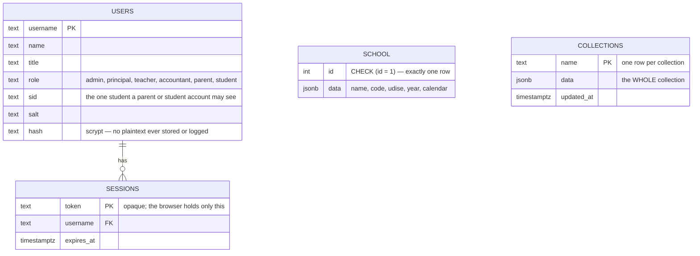
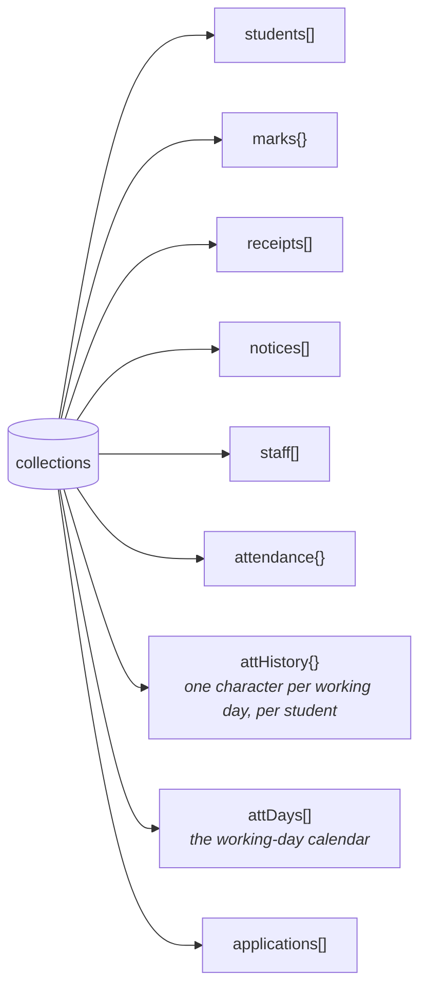
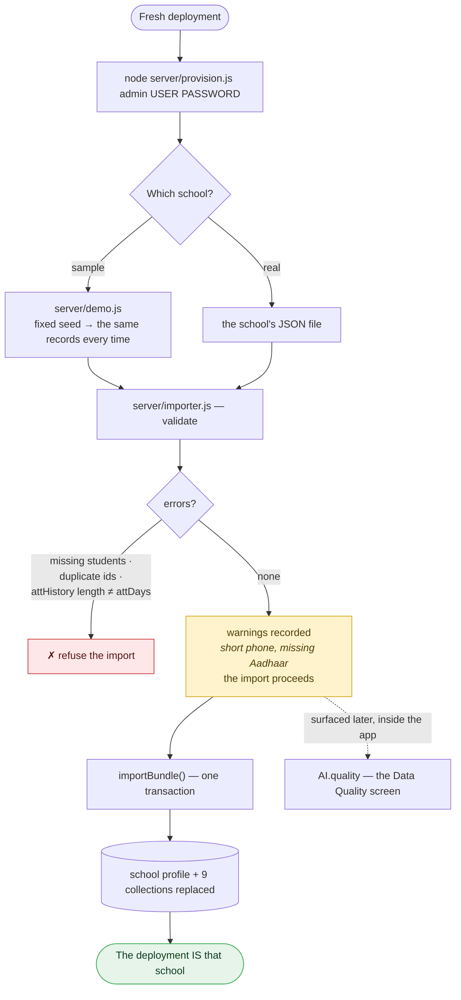
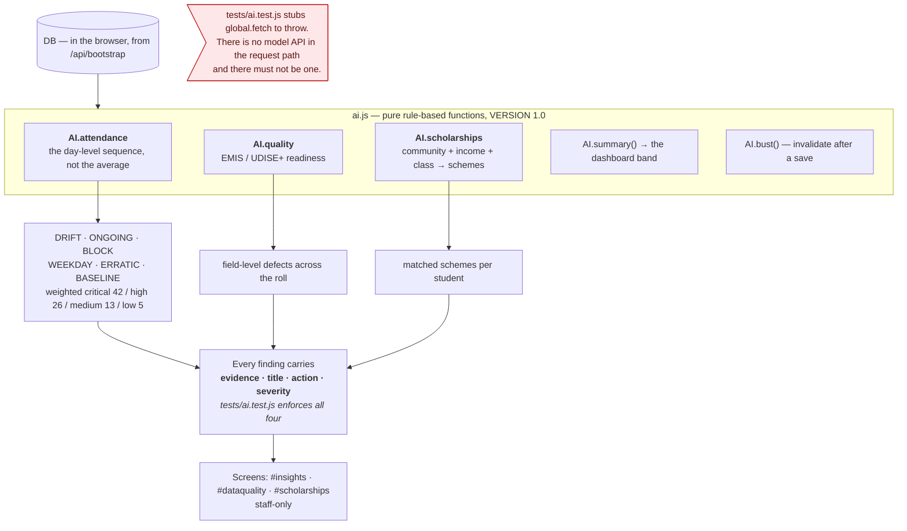
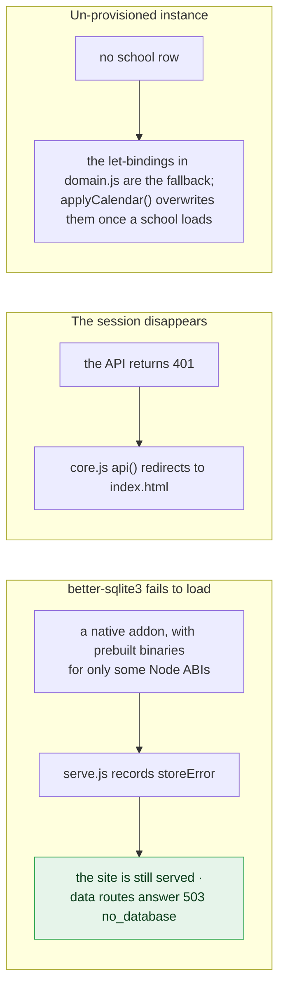
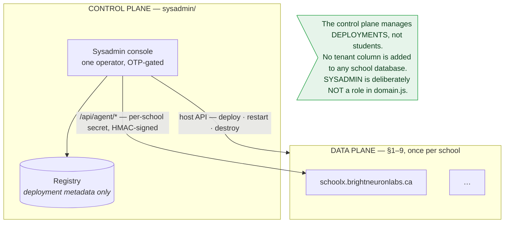

# Architecture — School Management Portal

Diagrams of the code as it stands. Every box below is a real file; the notes
record the constraints that made the shape what it is (see `CLAUDE.md`).

**One deployment serves one school.** There is no tenant column anywhere, so a
query can never cross from one school's children to another's. Schools are
isolated by deployment, not by a `WHERE` clause.

Sections 1–9 describe **one school deployment** — the data plane. A separate
control plane administers the fleet of them; see
[sysadmin-control-plane.md](sysadmin-control-plane.md) and §10 below.

---

## 1. System context



---

## 2. Module map



---

## 3. Request lifecycle



> `DB.save(name)` writes a **whole collection**, never a delta. What the browser
> holds after a save is exactly what the database holds.
> `localStorage` holds exactly one thing: the theme.

---

## 4. The `/api` surface and who may reach it

```mermaid
flowchart LR
    subgraph Open["No session required"]
        H["GET /api/health"]
        L["POST /api/login"]
        ST0["GET /api/status<br/><i>school name for index.html</i>"]
    end

    subgraph Session["Any signed-in role"]
        ME["GET /api/me"]
        BOOT["GET /api/bootstrap"]
        DATA["GET /api/data"]
        STU["GET /api/students<br/>GET /api/students/:id"]
        PW["POST /api/password"]
        LO["POST /api/logout"]
    end

    subgraph Staff["Staff write"]
        COL["GET · PUT /api/collection/:name"]
        SCH["GET · PUT /api/school"]
    end

    subgraph Admin["admin only"]
        PV["POST /api/provision/validate<br/>POST /api/provision/import<br/>POST /api/provision/demo<br/>POST /api/provision/wipe"]
        US["GET · POST /api/users<br/>DELETE /api/users/:username"]
    end

    Open --> Session --> Staff --> Admin
    style Open fill:#e6f4ea,stroke:#34a853,color:#0b3d1b
    style Session fill:#e7f1ff,stroke:#2b6cb0,color:#12345b
    style Staff fill:#fff3cd,stroke:#d39e00,color:#523e02
    style Admin fill:#fde7e9,stroke:#c5221f,color:#5c1512
```



**Roles are enforced in `serve.js`, not in the sidebar.** `allowed()` in `app.js`
hides navigation as a convenience; the API refuses regardless.
`tests/server.test.js` asserts both halves. Parents and students may read one
child (`user.sid`) and write nothing.

| Screen group | admin | principal | teacher | accountant | parent/student |
|---|:--:|:--:|:--:|:--:|:--:|
| Dashboard · Circulars · Settings | ✓ | ✓ | ✓ | ✓ | ✓ |
| My Record | | | | | ✓ |
| Student Master | ✓ | ✓ | ✓ | ✓ | |
| New Admission | ✓ | ✓ | | | |
| Attendance · Mark Entry · Report Cards | ✓ | ✓ | ✓ | | |
| Fee Collection · Fee Dues | ✓ | ✓ | | ✓ | |
| Staff · Reports & Govt. | ✓ | ✓ | | | |
| **Attendance Alerts** (AI) | ✓ | ✓ | ✓ | | |
| **Data Quality** (AI) | ✓ | ✓ | | | |
| **Scholarship Match** (AI) | ✓ | ✓ | | ✓ | |
| School Data — provisioning | ✓ | | | | |

The AI screens are staff-only: parents and students never see risk scores about
a child.

---

## 5. Data model



The nine rows in `collections`:



> Stored whole rather than a row per record because the portal saves a whole
> collection at a time. Correct at school scale; the wrong shape at district
> scale — a comment in `db.js`, not a TODO.
>
> `attHistory[sid].length` must equal `attDays.length`; the importer treats a
> mismatch as a hard error.

---

## 6. Provisioning — how a deployment becomes a school



The importer **reports rather than repairs**, and the two categories are
load-bearing. Refusing a file because 3% of guardians have no second phone
number would mean no school could ever onboard — those defects are exactly what
the data-quality engine exists to surface later. Import is transactional: a
failed import never leaves half a school.

The sample school seeds a malformed Aadhaar, short phone numbers and missing
groups **on purpose**, at realistic rates, so the data-quality engine has true
faults to find. It is imported through the same path as a real school, with no
privileged route into the app.

---

## 7. Intelligence layer



This is the part of the product that matters — it is why the application exists
rather than being another CRUD form set. Under the DPDP Act 2023 every student
here is a child, so no student data leaves the device.

Attendance detection works on the day sequence because the aggregate hides the
thing that matters: a child at 68% drifting downward week by week and a child at
68% who missed one illness block are the same number and completely different
problems.

---

## 8. Failure modes designed in



`PRIVATE` in `serve.js` refuses `server`, `node_modules`, `tests`, `.git`,
`.env`, `data`, `migrations` over HTTP, whatever the URL says. **Any new
directory holding data or server code must be added there** — `data/` holds the
SQLite file with every student record in it.

---

## 9. Repository layout

```
School/
├── index.html            public site + sign-in  (fills [data-school-name] from /api/status)
├── app.html              portal shell; four <script> tags, in a fixed order
├── serve.js              static server + /api + role enforcement + the PRIVATE list
├── assets/
│   ├── css/              base · site · app · ai
│   └── js/               domain → core → ai → app   (globals, no modules)
├── server/
│   ├── auth.js           scrypt, opaque sessions, HttpOnly cookie
│   ├── db.js             SQLite adapter        ┐ one contract,
│   ├── db_pg.js          Postgres adapter      ┘ documented at the top of db.js
│   ├── importer.js       validate → errors vs warnings, transactional
│   ├── demo.js           fixed-seed sample school (tests assert on S4102)
│   ├── provision.js      CLI: admin · import · demo · export · status
│   └── migrate.js        applies migrations/
├── migrations/001_init.sql   idempotent; re-runnable on every boot
├── samples/school-template.json
├── tests/
│   ├── ai.test.js        the three engines; stubs fetch to throw
│   └── server.test.js    sessions, roles, provisioning, persistence
│                         (real server, throwaway SQLite, skips without better-sqlite3)
├── data/                 the SQLite file — gitignored, never served
├── sysadmin/             the control plane — separate deployment, in PRIVATE
└── design/               these diagrams
```

No build step, no bundler, no linter. Tests are plain Node scripts that print
`PASS`/`FAIL` and call `process.exit(1)` on any failure.

---

## 10. Two planes

The diagrams above are one school. Administering many of them is a separate
application with a separate deployment, database and domain.



`sysadmin/` shares this repository but is never served by a school's `serve.js` —
it is in `PRIVATE`, and the dependency arrow points one way: no school code may
`require` control-plane code.

The tradeoff is stated honestly in the design document: the isolation property
weakens from *"there is no wire between deployments"* to *"every wire is
per-school, authenticated, and audited."*
