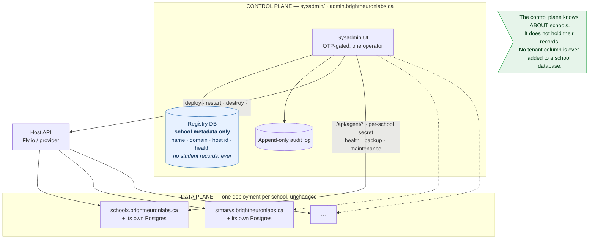
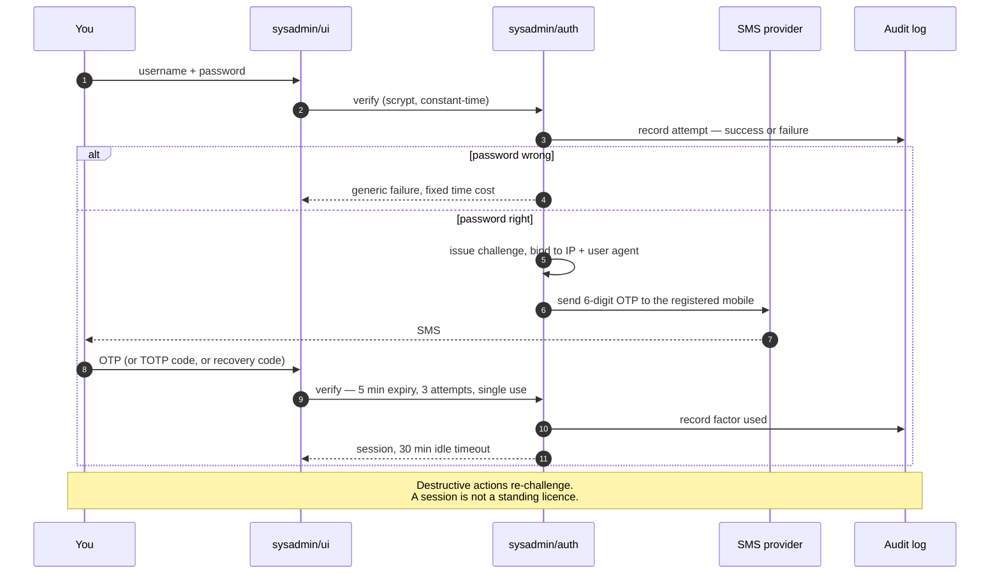
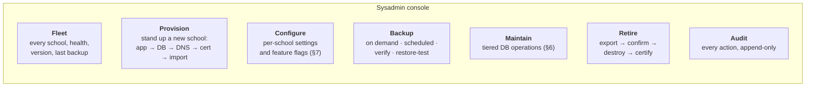
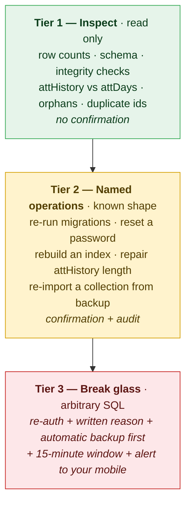

# SYSADMIN — the control plane

A design change. Adds a single-operator administration portal covering every
school, in a new `sysadmin/` folder, with OTP two-factor authentication.

Companion to [architecture.md](architecture.md), [deployment.md](deployment.md)
and [runbook-schoolx.md](runbook-schoolx.md).

---

## 1. The collision this design has to resolve

The requirement — *"one stop interface I would use to administer all schools"* —
contradicts the invariant the whole application rests on:

> **One deployment serves one school.** There is no tenant column anywhere, on
> purpose: schools are isolated by deployment, so a query cannot cross from one
> school's children to another's.

The obvious implementation — add `'sysadmin'` to `ROLES` in
[domain.js:30](../assets/js/domain.js#L30) and a `user.role === 'sysadmin'`
branch beside `const admin = user.role === 'admin'` in
[serve.js:169](../serve.js#L169) — fails on three counts:

1. **It doesn't deliver what was asked.** Each school is a separate deployment
   with a separate database. A sysadmin role inside the school app gives you a
   login *per school*. Thirty schools, thirty logins. That is the opposite of one
   stop.
2. **It destroys the isolation guarantee.** The moment a credential class exists
   whose purpose is to reach across schools, "a query cannot cross from one
   school's children to another's" stops being structural and becomes a promise.
   The property is currently enforced by there being no wire between deployments.
3. **The blast radius becomes total.** One password, every school's children.

**Resolution: SYSADMIN is not a role in the school application. It is a separate
control plane.**



**Why this preserves the invariant.** Each school's database still has no tenant
column and still cannot be queried across. The control plane manages
*deployments* — infrastructure objects — not students. When it does need a
school's data (a backup, a repair), it asks that one deployment, over an
authenticated channel scoped to that school, and the request is logged.

The isolation property changes from *"there is no wire"* to *"every wire is
per-school, authenticated, and audited."* That is a real weakening, and it must
be paid for with the controls in §5 and §6. It is not free, and the design
should say so plainly rather than pretend the guarantee is untouched.

---

## 2. Folder layout

All control-plane code in `sysadmin/`, deployed separately from any school.

```
sysadmin/
├── README.md              the contract; start here
├── serve.js               control-plane HTTP server (own port, own process)
├── auth/
│   ├── totp.js            RFC 6238 — the primary second factor
│   ├── otp.js             SMS OTP — issue, verify, rate-limit, expire
│   ├── sms.js             provider adapter (MSG91 / Twilio / Gupshup)
│   ├── recovery.js        one-time recovery codes
│   └── session.js         short-lived sessions, step-up re-auth
├── registry/
│   ├── db.js              registry storage — schools, audit, operators
│   └── schema.sql         idempotent, same convention as migrations/001_init.sql
├── providers/
│   └── fly.js             host adapter: deploy · restart · destroy · secrets · logs
├── ops/
│   ├── provision.js       stand up a new school end to end
│   ├── backup.js          pull + verify + store school backups
│   ├── maintenance.js     tiered database operations (§6)
│   └── health.js          poll every school's /api/health
├── ui/                    the portal itself — same dependency-free idiom
│   ├── index.html         login + OTP challenge
│   ├── app.html           the console
│   └── assets/
└── config/
    └── schools.example.json
```

**Two rules for this folder, both load-bearing:**

- **Nothing in `sysadmin/` may be `require`d by the school application, and
  nothing in `server/` may `require` anything from `sysadmin/`.** The dependency
  arrow points one way only. A school deployment that cannot import control-plane
  code cannot be tricked into executing it.
- **`sysadmin/` is never served by `serve.js`.** It sits in the same repository,
  so the school's static server would happily serve it. See §9 — this is already
  fixed.

---

## 3. Authentication — one operator, two factors

You are the only account. That simplifies the threat model and sharpens it: there
is exactly one credential set standing between the internet and every school's
children, and no colleague who would notice it being misused.



### Design decisions

**The mobile number is set at provisioning time, in an environment variable, and
cannot be changed from the UI.** A "change my number" screen is a complete
account takeover primitive for a single-operator system. Changing it is a
redeploy — deliberately inconvenient.

**TOTP should be your primary factor; SMS OTP the fallback.** You asked for SMS,
and it is in the design, but it should not be the only thing:

- **SIM swap is the specific attack on this system.** One phone number is the
  only barrier to every school you host. SIM-swap fraud is routine in India, and
  it does not require touching your servers at all.
- **Indian SMS needs DLT registration.** Under TRAI rules, transactional SMS
  requires registering your header and message template on a DLT platform through
  an operator, via MSG91, Gupshup or similar. Budget **two to three weeks** and
  do it before you need it. TOTP has no provider, no cost, no registration and no
  delivery failure.
- **TOTP is offline.** No SMS gateway outage between you and a production
  incident at 11pm.

`totp.js` is roughly forty lines against Node's `crypto` — HMAC-SHA1 over a time
counter, base32 secret. Recommendation: TOTP required, SMS OTP available as
fallback, both logged so you can see which was used.

**Recovery codes are not optional.** Single operator means a lost phone locks you
out of every school simultaneously, during whatever incident made you log in.
Ten single-use codes, scrypt-hashed at rest, generated at setup, printed and
stored physically.

**Additional controls worth having, since it is one person:**

- IP allowlist (`SYSADMIN_ALLOWED_IPS`) — a home or office range. Cheap, and it
  removes the entire internet as an attacker.
- Sessions of 30 minutes idle, 8 hours absolute. Not the school app's 7 days.
- Lockout after 5 failed passwords; alert on every failure, to the same mobile.
- Unknown-username timing parity, exactly as
  [auth.js](../server/auth.js) already does for schools.

---

## 4. What the console does



**Provision** collapses [runbook-schoolx.md](runbook-schoolx.md) into one form:
create the Fly app in `sin`, attach Postgres, set secrets, deploy, add the DNS
record, issue the certificate, wait for health, then hand you the School Data
screen to import their JSON. The runbook stays the source of truth for what the
button does — and stays the fallback for when the button is broken.

**Retire** is the one to build carefully, because it is irreversible and it
deletes children's records:

1. Full export, verified by re-import into a scratch instance
2. Backup stored and its checksum recorded in the registry
3. Typed confirmation of the school's name — no "are you sure" dialog
4. Second factor re-challenged
5. Destroy app, database, volumes, DNS, certificate
6. A retention record: what was deleted, when, by whom, where the final backup
   lives, and when it is itself due for deletion

That last item matters under DPDP: data minimisation means the final backup is
not kept forever either. Give it an expiry at creation.

---

## 5. How the control plane reaches a school

Two channels, deliberately different.

| Channel | Used for | Authentication |
|---|---|---|
| **Host API** — `providers/fly.js` | deploy, restart, destroy, scale, secrets, logs | Fly API token, control plane only |
| **Agent API** — new `/api/agent/*` on each school | health, export, maintenance | **Per-school** shared secret, HMAC-signed, timestamped |

### Per-school secrets, not one global secret

Each deployment gets its own `AGENT_SECRET`, generated at provisioning. Nothing
else in the design does as much work for as little effort: compromise of one
school's secret exposes that school and nothing else, and rotating one school's
secret does not touch the others.

A single shared secret would rebuild exactly the cross-school key this design
exists to avoid.

### The agent endpoint on the school side

A small, closed surface added to the school app — `/api/agent/health`,
`/api/agent/export`, `/api/agent/maintenance`:

- Requests are HMAC-signed with a timestamp and a nonce; a replay outside a
  60-second window is refused.
- The endpoint is **off unless `AGENT_SECRET` is set**, so a school deployment
  without one behaves exactly as it does today.
- It is not reachable with a session cookie and no user account can invoke it —
  it is not a role, it is a separate authentication path with no UI.
- Every call is logged **on the school side too**, so a school can be shown what
  the control plane did to it. That is the honest answer to a school asking "what
  can you see?", and you will eventually be asked.

---

## 6. Database maintenance — the dangerous part

*"Provide back end fixes to database"* means a web console with write access to
children's records. Tier it, and make the dangerous tier feel dangerous.



**Tier 1 covers most real incidents.** The integrity checks worth building first
are the ones the importer already knows how to find — `attHistory[id].length !==
attDays.length` is the error that will actually page you, because it is the one
hard error a school's own data most often trips
([importer.js](../server/importer.js)).

**Tier 2 is where the value is.** Each operation is a named function with known
inputs, reviewed once, safe to run at 11pm. Every school-visible fix you make in
the first year should end up here rather than being retyped as SQL.

**Tier 3 exists because reality does.** Guard it:

- Automatic full backup *before* execution, non-negotiable
- Written reason, stored in the audit log
- Second factor re-challenged, even mid-session
- Transaction with an explicit commit step showing affected row counts first
- SMS to your own mobile whenever it is used — if you did not just do that, you
  need to know immediately

**The audit log must be append-only and stored outside the control plane's own
database.** An audit log that a compromised control plane can rewrite is
decoration. Ship it to the host's log service or an append-only object store.

Under the DPDP Act 2023 this whole surface is privileged access to children's
personal data. Who accessed what, when, and why is not bureaucracy here — it is
the thing that makes the access defensible.

---

## 7. Per-school configurability

*"Every other code and folder should be configurable per school."* Largely true
already — the branding, calendar and identity all come from the school profile,
and `applyCalendar()` in [domain.js:88](../assets/js/domain.js#L88) establishes
the exact pattern: `let` bindings holding fallbacks, overwritten from the loaded
profile.

Extend that pattern. Three tiers, and the third is a genuine pushback on the
requirement.

### Tier A — already per-school

`name`, `short`, `tamil`, `addr`, `phone`, `email`, `code`, `udise`, `year`,
`est`, `yearStart`, `yearWorkingDays`, `minAttendance`, `holidays`,
`workingDays`.

### Tier B — should become per-school

Currently `const` in `domain.js`, and genuinely different between schools:

| Constant | Line | Why it varies |
|---|---|---|
| `FEE_BY_CLASS` | [52](../assets/js/domain.js#L52) | Every school's fees differ. Hardcoding one school's is clearly wrong. |
| `FEE_HEADS` | [29](../assets/js/domain.js#L29) | Not every school has transport or lab fees |
| `EXAM_TERMS` | [28](../assets/js/domain.js#L28) | Term structures vary |
| `SECTIONS` | [21](../assets/js/domain.js#L21) | A small school has only A |
| `CLASSES` | [20](../assets/js/domain.js#L20) | A primary school has no XI–XII |
| `MEDIUMS` | [24](../assets/js/domain.js#L24) | Some schools are single-medium |
| `SUBJECTS_BY_LEVEL`, `GROUPS` | [32](../assets/js/domain.js#L32), [25](../assets/js/domain.js#L25) | Overridable, but default to the TN board map |

Mechanism, following the established idiom: `let` bindings plus an
`applyConfig(school.config)` beside `applyCalendar()`, called from the same place
in `core.js`. Absent keys keep the file's defaults, so every existing school and
every test continues to behave identically.

### Tier C — must NOT be per-school

Here the requirement should be narrowed, and the reason is in
[CLAUDE.md](../CLAUDE.md): *"Tamil Nadu domain specifics live here and are
regulatory, not decorative."*

| Constant | Why it must stay fixed |
|---|---|
| `COMMUNITIES` — OC/BC/BCM/MBC/SC/ST | State reservation categories. They drive scholarship eligibility. A school editing this doesn't customise the portal — it silently breaks children's entitlements, and the importer's validation with it. |
| `MIN_ATTENDANCE = 0.75` | The public-exam bar is set by the board, not the school. Configurable, a school could set 0.5 and its Std X students would find out they were ineligible in March. **Make it settable *upward* only** — a school may be stricter than the board, never laxer. |

`minAttendance` is already accepted per-school by the importer, which validates
only that it is a fraction in `(0, 1]`. **Tightening that to reject values below
0.75 is a change worth making as part of this work.**

### Tier D — feature flags

New, and what you will want commercially: `features: { fees, scholarships,
dataquality, insights, reports }`, defaulting to on, editable only from the
control plane. Two rules — the API enforces them exactly as
[serve.js](../serve.js) enforces roles today, never the sidebar alone; and no
flag may switch off an audit or security control.

---

## 8. What changes in the school application

Deliberately small. The control plane carries the complexity.

| Change | Where | Risk |
|---|---|---|
| Add `sysadmin` to `PRIVATE` | [serve.js:70](../serve.js#L70) | None — **done**, see §9 |
| `/api/agent/*`, off unless `AGENT_SECRET` is set | `serve.js` | Contained; a new authentication path with no UI and no role |
| `applyConfig()` beside `applyCalendar()` | `domain.js`, `core.js` | Low — same idiom, defaults preserved |
| Tier B constants `const` → `let` | `domain.js` | Low — mirrors the existing calendar bindings |
| Reject `minAttendance < 0.75` | `importer.js` | Low, and a correctness fix |
| Feature-flag checks | `serve.js`, `app.js` | Medium — must be enforced server-side |

**`'sysadmin'` is deliberately *not* added to `ROLES` in `domain.js`.** No school
database gains a cross-school credential. `ROLES` stays exactly as it is.

---

## 9. One change already made

`sysadmin/` lives in this repository, so the school's static server would serve
it — including, in time, the SMS provider adapter and the registry code. CLAUDE.md
requires it: *"Any new directory holding data or server code must be added
there."*

`PRIVATE` in [serve.js:70](../serve.js#L70) now reads:

```js
const PRIVATE = ['server', 'node_modules', 'tests', '.git', '.env', 'data',
                 'migrations', 'sysadmin'];
```

Requests to `/sysadmin/...` on any school deployment get **403 Forbidden**. Add
it to the sign-off checklist in [runbook-schoolx.md](runbook-schoolx.md).

---

## 10. Build order

Each stage is useful on its own, and nothing before stage 4 can damage a school.

| Stage | Scope | Value on its own |
|---|---|---|
| **1** | Registry + fleet view, read-only. Poll `/api/health`. Auth with password + TOTP. | You can see every school in one place. Zero write risk. |
| **2** | Backups: scheduled export, checksum, restore-test. | Closes the biggest operational gap today. |
| **3** | Per-school config — Tier B + feature flags. | Second school stops needing a code change. |
| **4** | Provision and retire, through `providers/fly.js`. | Onboarding drops from an hour to minutes. |
| **5** | Maintenance tiers 1 and 2. | Routine fixes without SSH. |
| **6** | SMS OTP fallback, once DLT registration clears. | Removes TOTP as a single point of failure. |
| **7** | Tier 3 break-glass, with every guard from §6. | Last, and only when the audit log is proven. |

Do **not** build in the order the console's tabs will appear in. Stage 1 and 2
are worth more than the deploy button, and they carry almost no risk.

---

## 11. Open decisions

1. **TOTP primary with SMS fallback, as recommended — or SMS only, as asked?**
   The DLT lead time makes this partly a scheduling question; TOTP works this
   week, SMS does not.
2. **IP allowlist?** Strong control, and an annoyance the day you need to fix
   something from an airport. Recovery codes plus TOTP may be the better trade.
3. **Does the control plane hold school backups, or only orchestrate them?**
   Holding them is convenient and makes it a repository of every school's
   children's records — a much larger target, and a much bigger DPDP obligation.
   Recommendation: orchestrate and verify, store in per-school encrypted object
   storage the control plane can write but not read back in bulk.
4. **Tier 3 break-glass at all?** Everything it does can be done over SSH with the
   same backup and audit discipline, and SSH is not reachable from a browser
   session that a phishing page can ride.
